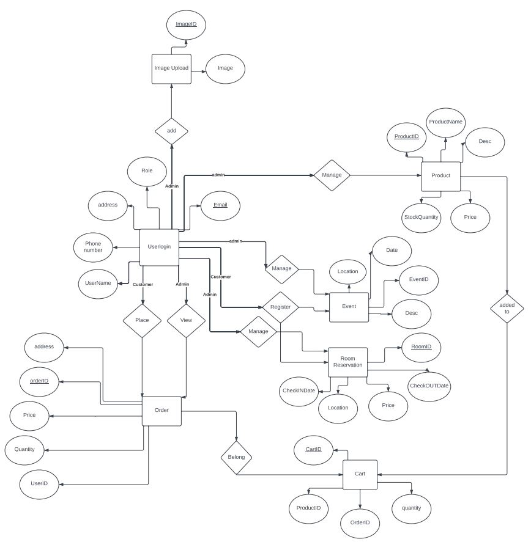
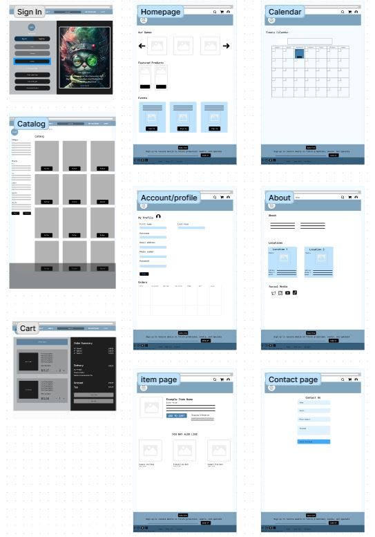

# Great Escape Games Website Revamp
*Worked on by SoftGroup*

Team members: Anuja Chouhan, Alexis Dawatan, Vayhout Lim, Chris Long, Dzmitry Matsiulka, Shari Nguyen, Bruno Reviglio, Voua Vang

# Synonsis

In CSC 190, our focus has been working with our client: Gary Lane. He is the owner of Great Escape Games, a local store specializing in board games and collectables. Gary's existing website is an outdated website that is counterproductive as it no longer serves the client's needs. Our primary task is to revamp the website and create a modernized interface while also adding new pages and functions that the old website did not have. Our goal is to create an interactive and dynamic website that will help the client better serve his customers' needs enhancing customer-client interaction. Throughout this semester, Soft Group has worked together to find the most suitable languages, IDE, API's, and databases for this project. We created ER Diagrams and prototype pages. Once we established the design, we proceeded into the developmental phase which included coding the front-end and the database. As the semester comes to an end, we discuss how we are proceeding with our work onto the upcoming semester and what we are hoping to achieve.

# Programming Languages 

The programming languages we are using throughout this project are CSS, HTML, and React. We chose these languages as it is fundamental to use when creating a dynamic website.

# IDE 
The IDE of choice is Visual Studio Code (VSCODE) as everyone in the group has experience with it and is user-friendly.

# Database 
FireBase is chosen as the backend and database, the reason being it is a simple application to use along with development options that work well with our plan for the application. 

# ERD
The ERD is shown below:

# Prototype 

We utilized Figma to help map out our website dynamics. It was also used to inform our client of a clear and concise picture of what steps we are planning to take.
Below we have provided a quick look into our layout. <a href="https://www.figma.com/file/AbiVev09xmJ9DRe81yQ1bO/Great-Escape-Games?type=whiteboard&node-id=0%3A1&t=VvZZ1qSWYkgmuEbh-1">For more details click here.
</a> 

# CSC 190 Progress

[//]: <> (Use your JIRA to create a timeline section with key milestones for your project)
[//]: <> (NOTE: When coming up with the timeline this is the timeline for what you expect to get done in 191 based on the user stories you created in the backlog for all the key features with estimates.)
JIRA Mile Stones Sprints 1-4
#### System Deployment: 
59,66,62,61,58,2,60
#### Data Base Model: 
64,67,65,68,69
#### UI/UX Design: 
51,48,49,53,54,57,56,52

# Plans for CSC191
#### Sprint 5: Complete UI/UX Design 
#### Sprint 6: Start Backend development

- Admin privilege
- User privilege
- Payment Portal
- Finish Web page connection
- User Accounts/Profiles
#### Sprint 7: Backend Development/Update UI-UX Design

- Mobel Version
- Backup and Recovery
- Security Development
- Inventory Development
#### Sprint 8: Begin app Testing/Update Backend Development/Update UI-UX Design

- Inventoy BugTesting
- Account BugTesting
- Backup and Recovery
- Payment Gateway
- UI/UX BugTesting
#### Sprint 9: App Testing/app feature development

- Backend BugTesting
- Updates to testing results
#### Sprint 10: Open App Testing/Bugfixing

- Open App testing to the client
- BugFixing of previous results
#### Sprint 11: Final BugFixing/Testing

- Open App BugFixing
- Final Backend/Front End Testing

#### Sprint 12: Full App deployment/BugFixing

# Setup Environment
GitHub
Pull code from respiratory:
(https://docs.github.com/en/repositories/creating-and-managing-repositories/cloning-a-repository)

To run react files:
[See Getting Starting with Create React App](#Getting-Started-with-Create-React-App)

FireBase setup:
(https://firebase.google.com/docs/hosting/github-integration#:~:text=You%20can%20integrate%20deploys%20to,PR%20on%20your%20GitHub%20repository.)

# Testing

Continue in CSC191

# Deployment

Continue in CSC191

# Developers Instruction

Continue in CSC191

# Getting Started with Create React App

This project was bootstrapped with [Create React App](https://github.com/facebook/create-react-app).

## Available Scripts

In the project directory, you can run:

### `npm start`

Runs the app in the development mode.\
Open [http://localhost:3000](http://localhost:3000) to view it in your browser.

The page will reload when you make changes.\
You may also see any lint errors in the console.

### `npm test`

Launches the test runner in the interactive watch mode.\
See the section about [running tests](https://facebook.github.io/create-react-app/docs/running-tests) for more information.

### `npm run build`

Builds the app for production to the `build` folder.\
It correctly bundles React in production mode and optimizes the build for the best performance.

The build is minified and the filenames include the hashes.\
Your app is ready to be deployed!

See the section about [deployment](https://facebook.github.io/create-react-app/docs/deployment) for more information.

### `npm run eject`

**Note: this is a one-way operation. Once you `eject`, you can't go back!**

If you aren't satisfied with the build tool and configuration choices, you can `eject` at any time. This command will remove the single build dependency from your project.

Instead, it will copy all the configuration files and the transitive dependencies (webpack, Babel, ESLint, etc) right into your project so you have full control over them. All of the commands except `eject` will still work, but they will point to the copied scripts so you can tweak them. At this point you're on your own.

You don't have to ever use `eject`. The curated feature set is suitable for small and middle deployments, and you shouldn't feel obligated to use this feature. However we understand that this tool wouldn't be useful if you couldn't customize it when you are ready for it.

## Learn More

You can learn more in the [Create React App documentation](https://facebook.github.io/create-react-app/docs/getting-started).

To learn React, check out the [React documentation](https://reactjs.org/).

### Code Splitting

This section has moved here: [https://facebook.github.io/create-react-app/docs/code-splitting](https://facebook.github.io/create-react-app/docs/code-splitting)

### Analyzing the Bundle Size

This section has moved here: [https://facebook.github.io/create-react-app/docs/analyzing-the-bundle-size](https://facebook.github.io/create-react-app/docs/analyzing-the-bundle-size)

### Making a Progressive Web App

This section has moved here: [https://facebook.github.io/create-react-app/docs/making-a-progressive-web-app](https://facebook.github.io/create-react-app/docs/making-a-progressive-web-app)

### Advanced Configuration

This section has moved here: [https://facebook.github.io/create-react-app/docs/advanced-configuration](https://facebook.github.io/create-react-app/docs/advanced-configuration)

### Deployment

This section has moved here: [https://facebook.github.io/create-react-app/docs/deployment](https://facebook.github.io/create-react-app/docs/deployment)

### `npm run build` fails to minify

This section has moved here: [https://facebook.github.io/create-react-app/docs/troubleshooting#npm-run-build-fails-to-minify](https://facebook.github.io/create-react-app/docs/troubleshooting#npm-run-build-fails-to-minify)
